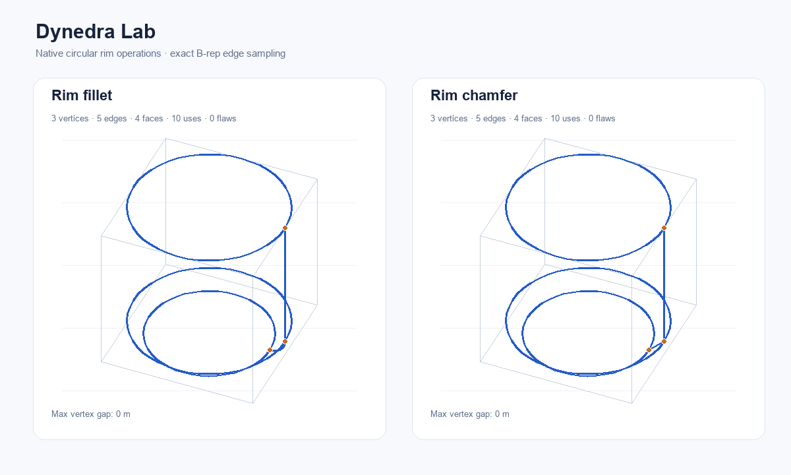

# Dynedra Lab

A native DynLex application for inspecting the port's computed geometry.
Seven scenarios use the same kernel modules as the numerical tests: a weighted
rational arc, a cubic Bezier curve, a helix, a NURBS surface, planar face
reconstruction, a variable-width polyline band and B-rep solid inspection.

Build the compiler normally, then run these commands from the repository root:

```sh
./build/dynlex examples/dynedra/main.dl -O2 -o build/dynedra-lab
./build/dynedra-lab
```

On Windows, use `build/dynlex.exe` and output `build/dynedra-lab.exe`.
The application loads the repository's licensed Liberation Mono font from
`tests/games/fonts/LiberationMono-Regular.ttf`. It reports a loading error if
the asset is unavailable. Native rendering uses the existing DynLex graphics
runtime; its platform requirements also apply here.

Choose an operation with the left buttons or keys 1-7. The first parameter
controls the arc's middle weight, Bezier/surface height, helix turns, the planar
partition position, the band's starting width, or the solid height/radius. The
second controls sample density; straight face reconstruction uses exact
intersections and has no sampling control. Band density is the number of
samples per half turn.
Geometry is regenerated only when its
inputs change. Coordinates and geometry calculations use binary64; presentation
conversion happens after projection.

| Input | Action |
| --- | --- |
| 1-7 | Select operation |
| Minus / plus | Decrease / increase primary parameter |
| Left / right bracket | Halve / double sample density |
| Drag in viewport; arrow keys | Orbit |
| Q / E; zoom buttons | Zoom |
| C | Show / hide control points, polygon/net, source guides or solid bounds/vertices |
| 0 | Reset view and all parameters |
| Escape | Close |

Cobalt strokes show calculated geometry. Ochre points and lines show controls
or the source geometry. Planar scenarios open in a near-overhead view; changing
scenario restores a suitable camera and zoom. Framing includes the computed
boundary as well as controls, so wider bands remain visible.
Distances are in metres. Curve lengths are sums over sampled segments, so they
are approximate and change with sample density. The helix also reports its
analytic kernel length. The surface reports total wire-grid length, not surface
area. The face scenario reconstructs the bounded regions in a divided 4-by-3
rectangle; it reports total enclosed area and face count. Moving the vertical
partition onto either outer edge reduces four faces to two. The band starts
with a straight segment and continues along a circular arc. Its final width
is 1.5 times its starting width, and it reports sampled boundary length beside
the analytic source length. Invalid scenario parameters display the refusal.

The B-rep scenario builds a cuboid, cylinder, sphere, cone, hexagonal pyramid,
hexagonal frustum, circular-rim fillet or circular-rim chamfer with native
kernel operations. Its primary parameter is height, except for the sphere where
it is radius. The cuboid has a 2-by-2 base; round solids and polygons use base
radius 1; the frustum top radius is 0.5. The two rim examples start from the
cylinder, recognize its first circular boundary and reconstruct the complete
solid after applying the blend. Shape buttons and N switch operations. The
parameter remains positive.

The solid representation uses the kernel's native face tessellation. Surface
triangles and normals are sent to one Vulkan triangle batch with depth testing;
the existing topological edges and seams remain as a cobalt overlay. Straight
edges remain one segment and the sample control changes curved edge density.
Ochre guides show kernel bounds and topological vertices independently of the
surface and edge sampling.

The inspection panel reports vertices, edges, faces, coedges (uses), loops,
shells, lumps, Euler characteristic, validation flaw count, maximum vertex gap
and the minimum/maximum kernel bounds. The measured length is the sum of
sampled edges and seams, not volume or surface area. Failed construction,
validation or unavailable bounds are reported explicitly.

The application needs a window of at least 900 by 750 pixels. Its default is
1280 by 820. It has no background camera animation.



The checked-in comparison drawing is generated from the O2 application's
native `lab scene` data, rather than from duplicated geometry. Regenerate both
the scalable SVG and PNG with:

```sh
python -B tests/cadkernel/lab/drawing/render.py --compiler build/dynlex.exe
```

The generator rejects either result unless its topology is 3 vertices, 5
edges, 4 faces and 10 coedges, validation reports no flaws, the maximum vertex
gap is at most `1e-9`, and edge segments were actually exported.

## Structure and checks

```sh
python -B tests/cadkernel/lab/verify.py
python -B tests/cadkernel/lab/verify.py --graphics
```

The graphics option requires a working native graphics device. It draws a
nonempty shaded surface for every solid and requires drawable frames rather
than accepting a skipped draw.

- `solids.dl` selects native solid constructors and defines scalar inspection metadata.
- `settings.dl` keeps state and input checks independent of the mesh-heavy model.
- `model.dl` constructs kernel scenarios and owns their sampled geometry and solid meshes.
- `state.dl` handles deterministic parameter/view transitions and projection.
- `input.dl` maps keyboard and pointer actions.
- `render.dl` draws the geometry, controls and measurements.
- `main.dl` owns the interactive window and event loop.

The extended fixtures under `tests/cadkernel/lab/model`, `state` and `graphics`
include the six original scenario fixtures without changing their expected
behavior. They additionally check all eight solid topologies, surface meshes and bounds,
analytic edge-length limits, sampling, retained scene storage, rejected sizes,
shape selection, parameter transitions and pointer boundaries. Graphics checks
draw the original six scenarios at 1280 by 820 and all eight shaded solids at
the supported minimum of 900 by 750, using hidden native windows.

The runner checks model, state and combined graphics/input fixtures at O0/O2
and compiles the interactive application at both levels. Each compilation has
an explicit 600-second budget while the mesh-heavy generic specializations are
being optimized; fixture execution has a 60-second budget.
Measured compile/run times are printed by the runner. It requires drawable
frames and an unchanged compiler hash. These checks do not constitute visual
inspection of the rendered pixels. CPU model/state coverage also runs through
the existing required-suite wrappers. The interactive program contains no
automated test sequence.
